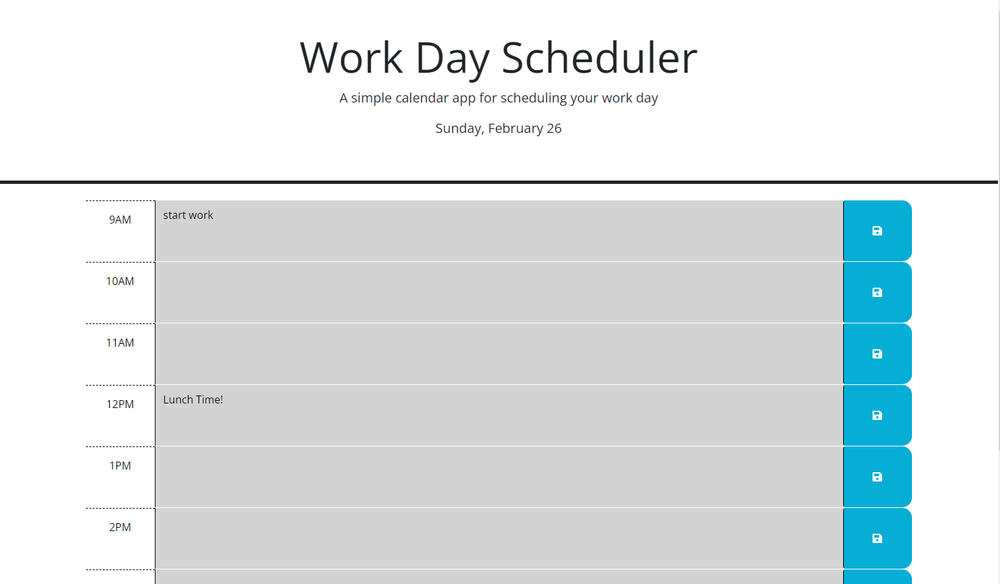

# Work-Day-Scheduler
## Description
this application is a simple work day scheduler that lets users input tasks or reminders in order to help the user be more organized and productive. The scheduler has nine time blocks (9am to 5pm) each of these timeblcks can be clicked and then the user can input tasks for that time that can then be saved to local storage by clicking the save button. All of the users imputs are automatically printed in that time slot when the page is refreshed or reloaded. The time blocks also change color depending on the time of day, when the time block has passed it will be grey, when its the current time block it will be red and the future time blocks will be green.  
## Code Source
This code was refactored from the scource code 
[Source code is from Georgeyoo on GitHub](https://github.com/coding-boot-camp/crispy-octo-meme)
## ScreenShots

## Link to Deployed Site
[Work-Day Scheduler](https://elissamaine.github.io/Work-Day-Scheduler/)

